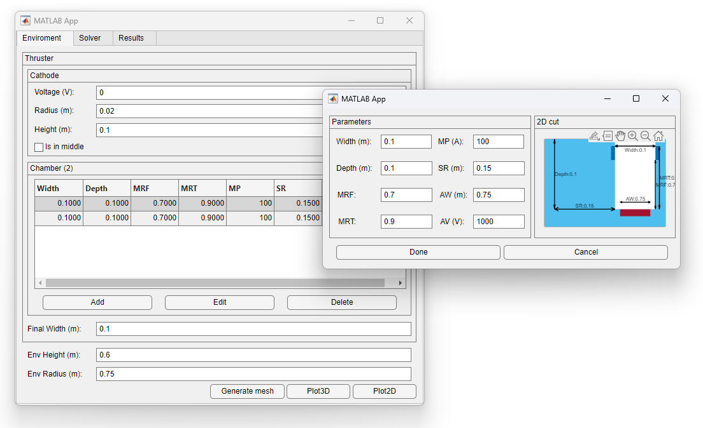
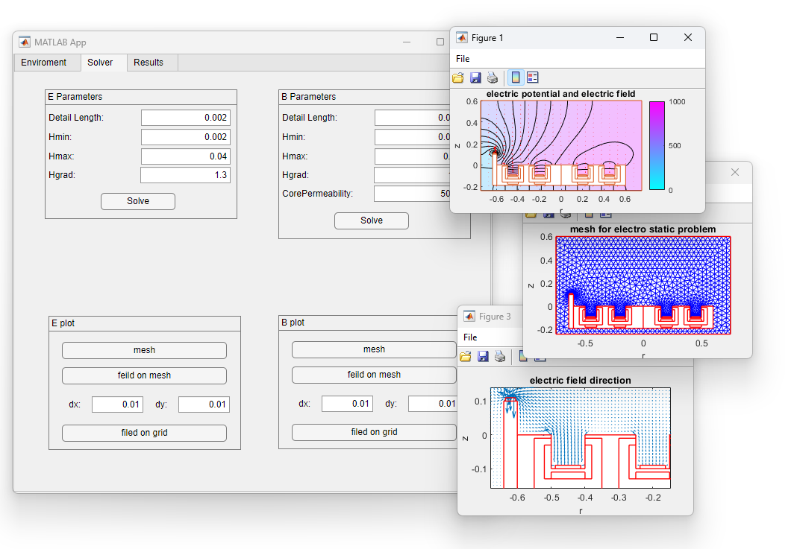
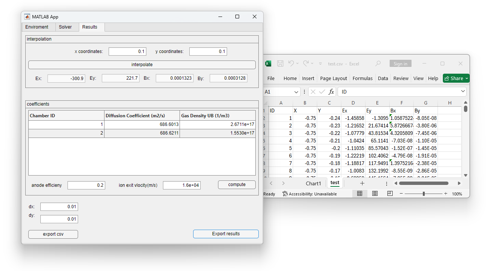

# 💻 Electromagnetic Field Explorer for Hall Thrusters-MATLAB

This project is a MATLAB-based application designed to simulate and visualize the electric and magnetic fields in a 2D Hall effect thruster configuration. Developed as a standalone UI app, it provides a user-friendly interface for researchers, students, and engineers to explore electromagnetic field behavior in Hall thruster geometries without needing to dive deep into code.

## 🔍 Key Features
- ⚡ Electric and Magnetic Field Calculation in 2D space

- 🧭 Intuitive graphical user interface built with MATLAB App Designer

- 🧮 Supports custom geometry inputs and boundary conditions

- 🧊 Field visualization through color maps, quiver plots, and vector fields

- 📦 All-in-one application: no need for external tools or toolboxes

## 🛠 Technologies

- Developed in MATLAB

- UI built using App Designer

- Uses finite difference method (FDM) for solving field equations

## 🚀 Use Cases

- Academic learning and demonstration of Hall thruster physics

- Quick simulations for design studies or parametric sweeps

- Visual analysis of E and B field interactions in propulsion systems

## ▶️ Usage Guide

### 1️⃣ Run the app

You can run the Electromagnetic Field Explorer for Hall Thrusters in two ways: directly from MATLAB or using the standalone executable. first of all you need to clone the repository to your local machine: 
```bash
git clone https://github.com/mehranESB/hall-thruster-2D.git
```

**Option 1: Run from MATLAB**

💡 Nonte: Requires MATLAB with App Designer support.

1. Open **MATLAB**.

2. In the MATLAB **Command Window**, navigate to the project directory and run the app:
```matlab
>> cd hall-thruster-2D
>> main
```

**Option 2: Run the Standalone Executable**

💡 Nonte: MATLAB is not required, but MATLAB Runtime must be installed. [Download here](https://de.mathworks.com/products/compiler/matlab-runtime.html)

1. Go to the `exe/` folder inside the project.

2. Double-click on the `HallThrusterField.exe` file.

### 2️⃣ Design the Geometry

In the **Enviroment** tab of the application, you can design the 2D geometry of the Hall thruster. This section provides tools to define the simulation domain, including the thruster channel, boundaries, and regions of interest. Users can draw or input the chamber layout and assign boundary conditions such as anode, cathode, and dielectric walls. The defined geometry forms the foundation for the simulation and directly influences the accuracy and behavior of the electric and magnetic field calculations.



### 3️⃣ Set Up and Solve the Simulation

The **Solver** tab allows you to configure the mesh properties and run the simulation to calculate the electric and magnetic fields. Here, you can adjust the mesh resolution and spacing to control the accuracy and performance of the simulation. After setting the desired properties, you can run the solver to compute the field distributions. The results are then visualized directly in the app through various plotting options, including color maps, contour plots, and vector field representations for both electric and magnetic fields.



### 4️⃣ View and Export Results

In the **Results** tab, the app provides options to interpolate the electric and magnetic fields within the defined geometry for more detailed insights. Additionally, you can export the results as a MATLAB structure or a CSV file, making it easy to study the data in other applications or use it for future analysis. This feature ensures flexibility for users who wish to integrate the results into larger workflows or save them for later use.



## 🤝 Contributing
Contributions are welcome and appreciated!

Feel free to fork the repository, submit pull requests, or open issues for bugs, feature suggestions, or improvements.

## 📄 License
This project is licensed under the MIT License.
See the `LICENSE.txt` file for details.


